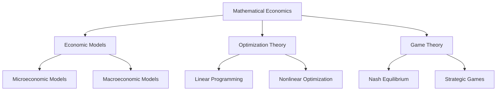

```mermaid
flowchart TD
    MathematicalEconomics[Mathematical Economics] --> Models[Economic Models]
    MathematicalEconomics --> Optimization[Optimization Theory]
    MathematicalEconomics --> GameTheory[Game Theory]
    Models --> Micro[Microeconomic Models]
    Models --> Macro[Macroeconomic Models]
    Optimization --> Linear[Linear Programming]
    Optimization --> Nonlinear[Nonlinear Optimization]
    GameTheory --> Nash[Nash Equilibrium]
    GameTheory --> Strategies[Strategic Games]
```