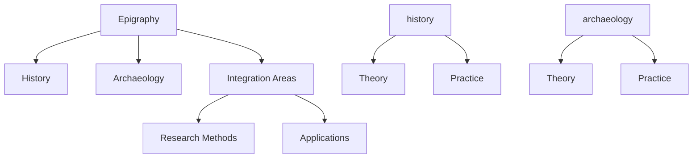

```mermaid
flowchart TD
    Epigraphy[Epigraphy] --> Field1[History]
    Epigraphy --> Field2[Archaeology]
    Epigraphy --> Integration[Integration Areas]
    history --> historySub1[Theory]
    history --> historySub2[Practice]
    archaeology --> archaeologySub1[Theory]
    archaeology --> archaeologySub2[Practice]
    Integration --> Methods[Research Methods]
    Integration --> Applications[Applications]
```