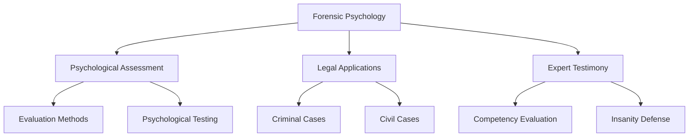

```mermaid
flowchart TD
    ForensicPsychology[Forensic Psychology] --> Assessment[Psychological Assessment]
    ForensicPsychology --> Legal[Legal Applications]
    ForensicPsychology --> Testimony[Expert Testimony]
    Assessment --> Evaluation[Evaluation Methods]
    Assessment --> Testing[Psychological Testing]
    Legal --> Criminal[Criminal Cases]
    Legal --> Civil[Civil Cases]
    Testimony --> Competency[Competency Evaluation]
    Testimony --> Insanity[Insanity Defense]
```