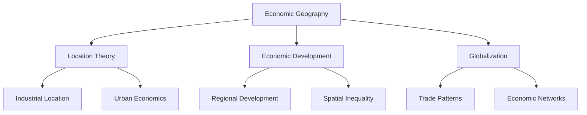

```mermaid
flowchart TD
    EconomicGeography[Economic Geography] --> Location[Location Theory]
    EconomicGeography --> Development[Economic Development]
    EconomicGeography --> Globalization[Globalization]
    Location --> Industrial[Industrial Location]
    Location --> Urban[Urban Economics]
    Development --> Regional[Regional Development]
    Development --> Inequality[Spatial Inequality]
    Globalization --> Trade[Trade Patterns]
    Globalization --> Networks[Economic Networks]
```