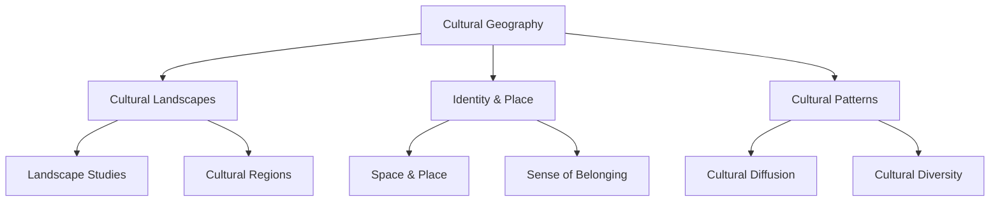

```mermaid
flowchart TD
    CulturalGeography[Cultural Geography] --> Culture[Cultural Landscapes]
    CulturalGeography --> Identity[Identity & Place]
    CulturalGeography --> Patterns[Cultural Patterns]
    Culture --> Landscapes[Landscape Studies]
    Culture --> Regions[Cultural Regions]
    Identity --> Space[Space & Place]
    Identity --> Belonging[Sense of Belonging]
    Patterns --> Diffusion[Cultural Diffusion]
    Patterns --> Diversity[Cultural Diversity]
```