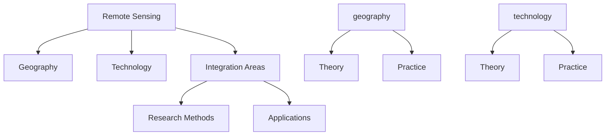

```mermaid
flowchart TD
    RemoteSensing[Remote Sensing] --> Field1[Geography]
    RemoteSensing --> Field2[Technology]
    RemoteSensing --> Integration[Integration Areas]
    geography --> geographySub1[Theory]
    geography --> geographySub2[Practice]
    technology --> technologySub1[Theory]
    technology --> technologySub2[Practice]
    Integration --> Methods[Research Methods]
    Integration --> Applications[Applications]
```