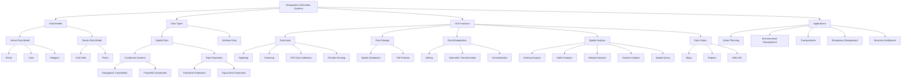

```mermaid
flowchart TD
    GIS[Geographic Information Systems] --> DataModel[Data Models]
    GIS --> DataTypes[Data Types]
    GIS --> Functions[GIS Functions]
    DataModel --> Vector[Vector Data Model]
    DataModel --> Raster[Raster Data Model]
    Vector --> Points[Points]
    Vector --> Lines[Lines]
    Vector --> Polygons[Polygons]
    Raster --> GridCells[Grid Cells]
    Raster --> Pixels[Pixels]
    DataTypes --> Spatial[Spatial Data]
    DataTypes --> Attribute[Attribute Data]
    Spatial --> Coordinates[Coordinate Systems]
    Spatial --> Projections[Map Projections]
    Coordinates --> Geographic[Geographic Coordinates]
    Coordinates --> Projected[Projected Coordinates]
    Projections --> Conformal[Conformal Projections]
    Projections --> EqualArea[Equal Area Projections]
    Functions --> Input[Data Input]
    Functions --> Storage[Data Storage]
    Functions --> Manipulation[Data Manipulation]
    Functions --> Analysis[Spatial Analysis]
    Functions --> Output[Data Output]
    Input --> Digitizing[Digitizing]
    Input --> Scanning[Scanning]
    Input --> GPS[GPS Data Collection]
    Input --> RemoteSensing[Remote Sensing]
    Storage --> Databases[Spatial Databases]
    Storage --> FileFormats[File Formats]
    Manipulation --> Editing[Editing]
    Manipulation --> Transformation[Geometric Transformation]
    Manipulation --> Generalization[Generalization]
    Analysis --> Overlay[Overlay Analysis]
    Analysis --> Buffer[Buffer Analysis]
    Analysis --> Network[Network Analysis]
    Analysis --> Surface[Surface Analysis]
    Analysis --> Query[Spatial Query]
    Output --> Maps[Maps]
    Output --> Reports[Reports]
    Output --> WebGIS[Web GIS]
    GIS --> Applications[Applications]
    Applications --> UrbanPlanning[Urban Planning]
    Applications --> Environmental[Environmental Management]
    Applications --> Transportation[Transportation]
    Applications --> Emergency[Emergency Management]
    Applications --> Business[Business Intelligence]
```