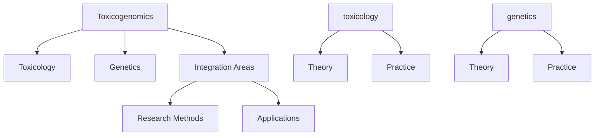

```mermaid
flowchart TD
    Toxicogenomics[Toxicogenomics] --> Field1[Toxicology]
    Toxicogenomics --> Field2[Genetics]
    Toxicogenomics --> Integration[Integration Areas]
    toxicology --> toxicologySub1[Theory]
    toxicology --> toxicologySub2[Practice]
    genetics --> geneticsSub1[Theory]
    genetics --> geneticsSub2[Practice]
    Integration --> Methods[Research Methods]
    Integration --> Applications[Applications]
```