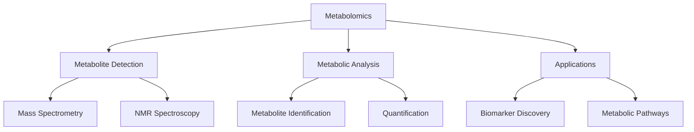

```mermaid
flowchart TD
    Metabolomics[Metabolomics] --> Detection[Metabolite Detection]
    Metabolomics --> Analysis[Metabolic Analysis]
    Metabolomics --> Applications[Applications]
    Detection --> MS[Mass Spectrometry]
    Detection --> NMR[NMR Spectroscopy]
    Analysis --> Identification[Metabolite Identification]
    Analysis --> Quantification[Quantification]
    Applications --> Biomarkers[Biomarker Discovery]
    Applications --> Pathways[Metabolic Pathways]
```