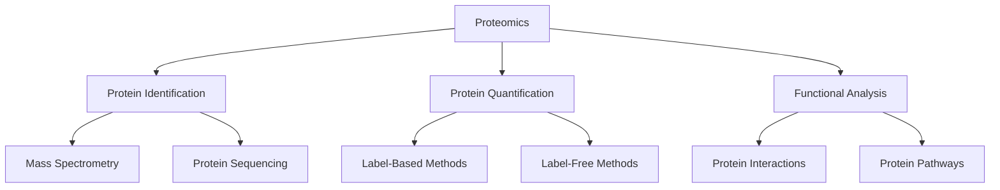

```mermaid
flowchart TD
    Proteomics[Proteomics] --> Identification[Protein Identification]
    Proteomics --> Quantification[Protein Quantification]
    Proteomics --> Analysis[Functional Analysis]
    Identification --> Mass[Mass Spectrometry]
    Identification --> Sequencing[Protein Sequencing]
    Quantification --> Label[Label-Based Methods]
    Quantification --> LabelFree[Label-Free Methods]
    Analysis --> Interactions[Protein Interactions]
    Analysis --> Pathways[Protein Pathways]
```