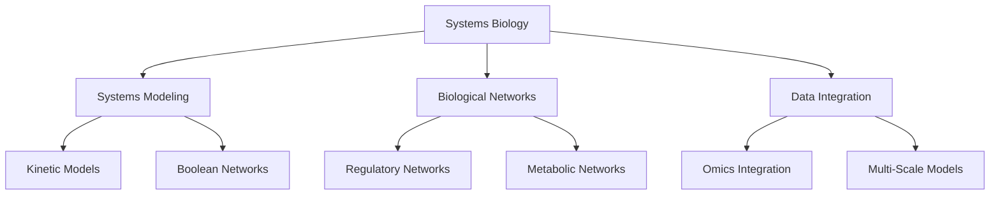

```mermaid
flowchart TD
    SystemsBiology[Systems Biology] --> Modeling[Systems Modeling]
    SystemsBiology --> Networks[Biological Networks]
    SystemsBiology --> Integration[Data Integration]
    Modeling --> Kinetic[Kinetic Models]
    Modeling --> Boolean[Boolean Networks]
    Networks --> Regulatory[Regulatory Networks]
    Networks --> Metabolic[Metabolic Networks]
    Integration --> Omics[Omics Integration]
    Integration --> MultiScale[Multi-Scale Models]
```