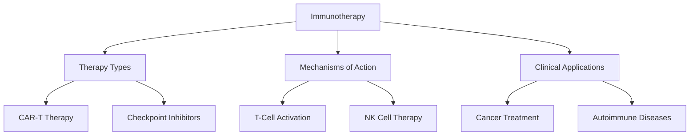

```mermaid
flowchart TD
    Immunotherapy[Immunotherapy] --> Types[Therapy Types]
    Immunotherapy --> Mechanisms[Mechanisms of Action]
    Immunotherapy --> Applications[Clinical Applications]
    Types --> CAR[CAR-T Therapy]
    Types --> Checkpoint[Checkpoint Inhibitors]
    Mechanisms --> TCell[T-Cell Activation]
    Mechanisms --> NK[NK Cell Therapy]
    Applications --> Cancer[Cancer Treatment]
    Applications --> Autoimmune[Autoimmune Diseases]
```