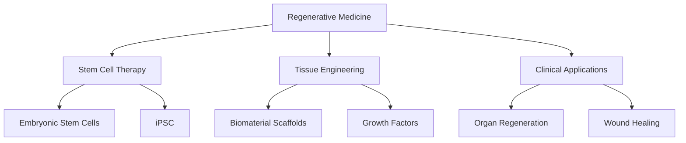

```mermaid
flowchart TD
    RegenerativeMedicine[Regenerative Medicine] --> StemCells[Stem Cell Therapy]
    RegenerativeMedicine --> Tissue[Tissue Engineering]
    RegenerativeMedicine --> Applications[Clinical Applications]
    StemCells --> Embryonic[Embryonic Stem Cells]
    StemCells --> Induced[iPSC]
    Tissue --> Scaffolds[Biomaterial Scaffolds]
    Tissue --> Growth[Growth Factors]
    Applications --> Organ[Organ Regeneration]
    Applications --> Wound[Wound Healing]
```