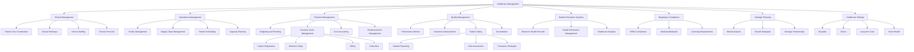

```mermaid
flowchart TD
    HCM[Healthcare Management] --> Clinical[Clinical Management]
    HCM --> Operations[Operations Management]
    HCM --> Financial[Financial Management]
    HCM --> Quality[Quality Management]
    Clinical --> PatientCare[Patient Care Coordination]
    Clinical --> ClinicalPathways[Clinical Pathways]
    Clinical --> Staffing[Clinical Staffing]
    Clinical --> Protocols[Clinical Protocols]
    Operations --> Facilities[Facility Management]
    Operations --> SupplyChain[Supply Chain Management]
    Operations --> Scheduling[Patient Scheduling]
    Operations --> Capacity[Capacity Planning]
    Financial --> Budgeting[Budgeting and Planning]
    Financial --> Revenue[Revenue Cycle Management]
    Financial --> Cost[Cost Accounting]
    Financial --> Reimbursement[Reimbursement Management]
    Revenue --> Registration[Patient Registration]
    Revenue --> Coding[Medical Coding]
    Revenue --> Billing[Billing]
    Revenue --> Collections[Collections]
    Quality --> Performance[Performance Metrics]
    Quality --> Outcomes[Outcomes Measurement]
    Quality --> Safety[Patient Safety]
    Quality --> Accreditation[Accreditation]
    Safety --> IncidentReporting[Incident Reporting]
    Safety --> RiskAssessment[Risk Assessment]
    Safety --> Prevention[Prevention Strategies]
    HCM --> Information[Health Information Systems]
    Information --> EHR[Electronic Health Records]
    Information --> HIM[Health Information Management]
    Information --> Analytics[Healthcare Analytics]
    HCM --> Compliance[Regulatory Compliance]
    Compliance --> HIPAA[HIPAA Compliance]
    Compliance --> Medicare[Medicare/Medicaid]
    Compliance --> Licensing[Licensing Requirements]
    HCM --> Strategic[Strategic Planning]
    Strategic --> MarketAnalysis[Market Analysis]
    Strategic --> Growth[Growth Strategies]
    Strategic --> Partnerships[Strategic Partnerships]
    HCM --> Settings[Healthcare Settings]
    Settings --> Hospitals[Hospitals]
    Settings --> Clinics[Clinics]
    Settings --> LongTerm[Long-term Care]
    Settings --> HomeHealth[Home Health]
```