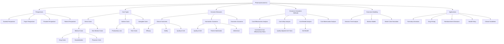

```mermaid
flowchart TD
    PE[Pharmacoeconomics] --> Perspectives[Perspectives]
    PE --> CostTypes[Cost Types]
    PE --> Outcomes[Outcome Measures]
    PE --> Methods[Economic Evaluation Methods]
    Perspectives --> Society[Societal Perspective]
    Perspectives --> Payer[Payer Perspective]
    Perspectives --> Provider[Provider Perspective]
    Perspectives --> Patient[Patient Perspective]
    CostTypes --> Direct[Direct Costs]
    CostTypes --> Indirect[Indirect Costs]
    CostTypes --> Intangible[Intangible Costs]
    Direct --> Medical[Medical Costs]
    Direct --> NonMedical[Non-Medical Costs]
    Medical --> Drug[Drug Costs]
    Medical --> Hospital[Hospitalization]
    Medical --> Physician[Physician Visits]
    Indirect --> Productivity[Productivity Loss]
    Indirect --> Time[Time Costs]
    Outcomes --> Clinical[Clinical Outcomes]
    Outcomes --> Humanistic[Humanistic Outcomes]
    Outcomes --> Economic[Economic Outcomes]
    Clinical --> Efficacy[Efficacy]
    Clinical --> Safety[Safety]
    Clinical --> Quality[Quality of Life]
    Humanistic --> QOL[Quality of Life]
    Humanistic --> Satisfaction[Patient Satisfaction]
    Humanistic --> Adherence[Adherence]
    Methods --> CEA[Cost Effectiveness Analysis]
    Methods --> CUA[Cost Utility Analysis]
    Methods --> CBA[Cost Benefit Analysis]
    Methods --> CMA[Cost Minimization Analysis]
    CEA --> ICER[Incremental Cost Effectiveness Ratio]
    CUA --> QALY[Quality Adjusted Life Years]
    CBA --> NetBenefit[Net Benefit]
    PE --> Modeling[Economic Modeling]
    Modeling --> DecisionTree[Decision Tree Analysis]
    Modeling --> Markov[Markov Models]
    Modeling --> Simulation[Monte Carlo Simulation]
    PE --> Applications[Applications]
    Applications --> Formulary[Formulary Decisions]
    Applications --> Pricing[Drug Pricing]
    Applications --> Reimbursement[Reimbursement Decisions]
    Applications --> Policy[Health Policy]
    Applications --> Guidelines[Clinical Guidelines]
```