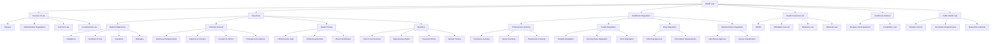

```mermaid
flowchart TD
    HL[Health Law] --> Sources[Sources of Law]
    HL --> Areas[Key Areas]
    HL --> Regulation[Healthcare Regulation]
    Sources --> Statutes[Statutes]
    Sources --> Regulations[Administrative Regulations]
    Sources --> CommonLaw[Common Law]
    Sources --> Constitutional[Constitutional Law]
    Areas --> Malpractice[Medical Malpractice]
    Areas --> Consent[Informed Consent]
    Areas --> Privacy[Health Privacy]
    Areas --> Bioethics[Bioethics]
    Malpractice --> Negligence[Negligence]
    Malpractice --> Standard[Standard of Care]
    Malpractice --> Causation[Causation]
    Malpractice --> Damages[Damages]
    Consent --> Disclosure[Disclosure Requirements]
    Consent --> Capacity[Capacity to Consent]
    Consent --> Minors[Consent for Minors]
    Consent --> Emergency[Emergency Exceptions]
    Privacy --> HIPAA[HIPAA Privacy Rule]
    Privacy --> Security[HIPAA Security Rule]
    Privacy --> Breach[Breach Notification]
    Bioethics --> EndOfLife[End of Life Decisions]
    Bioethics --> Reproductive[Reproductive Rights]
    Bioethics --> Research[Research Ethics]
    Bioethics --> Genetics[Genetic Testing]
    Regulation --> Licensing[Professional Licensing]
    Regulation --> Facilities[Facility Regulation]
    Regulation --> Drugs[Drug Regulation]
    Regulation --> Devices[Medical Device Regulation]
    Licensing --> Physicians[Physician Licensing]
    Licensing --> Nurses[Nurse Licensing]
    Licensing --> Pharmacists[Pharmacist Licensing]
    Facilities --> Hospitals[Hospital Regulation]
    Facilities --> NursingHomes[Nursing Home Regulation]
    Facilities --> Clinics[Clinic Regulation]
    Drugs --> FDA[FDA Drug Approval]
    Drugs --> Prescription[Prescription Requirements]
    Devices --> FDAApproval[FDA Device Approval]
    Devices --> Classification[Device Classification]
    HL --> Insurance[Health Insurance Law]
    Insurance --> ERISA[ERISA]
    Insurance --> ACA[Affordable Care Act]
    Insurance --> Medicare[Medicare Law]
    Insurance --> Medicaid[Medicaid Law]
    HL --> Antitrust[Healthcare Antitrust]
    Antitrust --> Mergers[Mergers and Acquisitions]
    Antitrust --> Competition[Competition Law]
    HL --> PublicHealth[Public Health Law]
    PublicHealth --> DiseaseControl[Disease Control]
    PublicHealth --> Vaccination[Vaccination Requirements]
    PublicHealth --> Quarantine[Quarantine Authority]
```