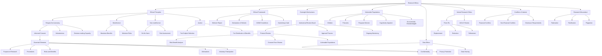

```mermaid
flowchart TD
    RE[Research Ethics] --> Principles[Ethical Principles]
    RE --> Framework[Ethical Framework]
    RE --> Oversight[Oversight Mechanisms]
    Principles --> Autonomy[Respect for Autonomy]
    Principles --> Beneficence[Beneficence]
    Principles --> Nonmaleficence[Non-maleficence]
    Principles --> Justice[Justice]
    Autonomy --> InformedConsent[Informed Consent]
    Autonomy --> Voluntariness[Voluntariness]
    Autonomy --> Capacity[Decision-making Capacity]
    Beneficence --> MaximizeBenefits[Maximize Benefits]
    Beneficence --> MinimizeRisks[Minimize Risks]
    Nonmaleficence --> DoNoHarm[Do No Harm]
    Nonmaleficence --> RiskAssessment[Risk Assessment]
    Justice --> FairSelection[Fair Subject Selection]
    Justice --> FairDistribution[Fair Distribution of Benefits]
    Framework --> Belmont[Belmont Report]
    Framework --> Declaration[Declaration of Helsinki]
    Framework --> CIOMS[CIOMS Guidelines]
    Framework --> Nuremberg[Nuremberg Code]
    Oversight --> IRB[Institutional Review Board]
    IRB --> Review[Protocol Review]
    IRB --> Approval[Approval Process]
    IRB --> Monitoring[Ongoing Monitoring]
    Review --> RiskBenefit[Risk-Benefit Analysis]
    Review --> ConsentForm[Consent Form Review]
    Review --> Vulnerable[Vulnerable Populations]
    InformedConsent --> Elements[Essential Elements]
    Elements --> Purpose[Purpose of Research]
    Elements --> Procedures[Procedures]
    Elements --> Risks[Risks and Benefits]
    Elements --> Alternatives[Alternatives]
    Elements --> Confidentiality[Confidentiality]
    Elements --> Voluntary[Voluntary Participation]
    RE --> VulnerablePop[Vulnerable Populations]
    VulnerablePop --> Children[Children]
    VulnerablePop --> Prisoners[Prisoners]
    VulnerablePop --> Pregnant[Pregnant Women]
    VulnerablePop --> CognitivelyImpaired[Cognitively Impaired]
    VulnerablePop --> EconomicallyDisadvantaged[Economically Disadvantaged]
    RE --> DataEthics[Data Ethics]
    DataEthics --> Privacy[Privacy Protection]
    DataEthics --> Confidentiality[Confidentiality]
    DataEthics --> DataSharing[Data Sharing]
    RE --> AnimalResearch[Animal Research Ethics]
    AnimalResearch --> ThreeRs[Three Rs]
    ThreeRs --> Replacement[Replacement]
    ThreeRs --> Reduction[Reduction]
    ThreeRs --> Refinement[Refinement]
    AnimalResearch --> IACUC[IACUC Review]
    RE --> Conflicts[Conflicts of Interest]
    Conflicts --> Financial[Financial Conflicts]
    Conflicts --> NonFinancial[Non-Financial Conflicts]
    Conflicts --> Disclosure[Disclosure Requirements]
    RE --> ResearchMisconduct[Research Misconduct]
    ResearchMisconduct --> Fabrication[Fabrication]
    ResearchMisconduct --> Falsification[Falsification]
    ResearchMisconduct --> Plagiarism[Plagiarism]
```