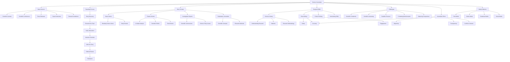

```mermaid
flowchart TD
    SJ[Science Journalism] --> Sources[News Sources]
    SJ --> Process[Reporting Process]
    SJ --> Formats[Story Formats]
    SJ --> Challenges[Challenges]
    Sources --> Journals[Scientific Journals]
    Sources --> Conferences[Scientific Conferences]
    Sources --> PressReleases[Press Releases]
    Sources --> Experts[Expert Interviews]
    Sources --> Institutions[Research Institutions]
    Process --> Discovery[Story Discovery]
    Discovery --> Research[Research the Topic]
    Research --> Verify[Verify Information]
    Verify --> Interview[Interview Scientists]
    Interview --> Write[Write the Story]
    Write --> Edit[Editorial Review]
    Edit --> Publish[Publication]
    Formats --> News[News Stories]
    Formats --> Features[Feature Articles]
    Formats --> Investigative[Investigative Reports]
    Formats --> Explanatory[Explanatory Journalism]
    News --> Breaking[Breaking Science News]
    News --> StudyResults[Study Results]
    Features --> InDepth[In-Depth Analysis]
    Features --> Profiles[Scientist Profiles]
    Features --> Trends[Trend Stories]
    Investigative --> Controversies[Scientific Controversies]
    Investigative --> Policy[Science Policy Issues]
    Explanatory --> Concepts[Scientific Concepts]
    Explanatory --> Methods[Research Methods]
    SJ --> Skills[Required Skills]
    Skills --> ScienceLiteracy[Science Literacy]
    Skills --> Writing[Clear Writing]
    Skills --> CriticalThinking[Critical Thinking]
    Skills --> Interviewing[Interviewing Skills]
    ScienceLiteracy --> Understanding[Understanding Research]
    ScienceLiteracy --> Statistics[Statistics]
    ScienceLiteracy --> Methodology[Research Methodology]
    Writing --> Clarity[Clarity]
    Writing --> Accuracy[Accuracy]
    Writing --> Engagement[Engagement]
    Challenges --> Complexity[Scientific Complexity]
    Challenges --> Uncertainty[Scientific Uncertainty]
    Challenges --> Deadlines[Deadline Pressure]
    Challenges --> Misinformation[Combating Misinformation]
    Challenges --> Balance[Balancing Perspectives]
    SJ --> Ethics[Journalistic Ethics]
    Ethics --> Accuracy[Accuracy]
    Ethics --> Objectivity[Objectivity]
    Ethics --> Transparency[Transparency]
    Ethics --> Conflicts[Conflict of Interest]
    SJ --> Media[Media Platforms]
    Media --> Print[Print Media]
    Media --> Online[Online Media]
    Media --> Broadcast[Broadcast Media]
    Media --> Social[Social Media]
```