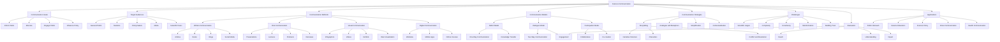

```mermaid
flowchart TD
    SC[Science Communication] --> Goals[Communication Goals]
    SC --> Audiences[Target Audiences]
    SC --> Methods[Communication Methods]
    SC --> Models[Communication Models]
    Goals --> Inform[Inform Public]
    Goals --> Educate[Educate]
    Goals --> Engage[Engage Public]
    Goals --> Influence[Influence Policy]
    Audiences --> General[General Public]
    Audiences --> Students[Students]
    Audiences --> Policymakers[Policymakers]
    Audiences --> Media[Media]
    Audiences --> Peers[Scientific Peers]
    Methods --> Written[Written Communication]
    Methods --> Oral[Oral Communication]
    Methods --> Visual[Visual Communication]
    Methods --> Digital[Digital Communication]
    Written --> Articles[Articles]
    Written --> Books[Books]
    Written --> Blogs[Blogs]
    Written --> SocialMedia[Social Media]
    Oral --> Presentations[Presentations]
    Oral --> Lectures[Lectures]
    Oral --> Podcasts[Podcasts]
    Oral --> Interviews[Interviews]
    Visual --> Infographics[Infographics]
    Visual --> Videos[Videos]
    Visual --> Exhibits[Exhibits]
    Visual --> DataViz[Data Visualization]
    Digital --> Websites[Websites]
    Digital --> Apps[Mobile Apps]
    Digital --> OnlineCourses[Online Courses]
    Models --> Deficit[Deficit Model]
    Models --> Dialogue[Dialogue Model]
    Models --> Participation[Participation Model]
    Deficit --> OneWay[One-Way Communication]
    Deficit --> KnowledgeTransfer[Knowledge Transfer]
    Dialogue --> TwoWay[Two-Way Communication]
    Dialogue --> Engagement[Public Engagement]
    Participation --> Collaborative[Collaborative]
    Participation --> CoCreation[Co-creation]
    SC --> Strategies[Communication Strategies]
    Strategies --> Storytelling[Storytelling]
    Strategies --> Analogies[Analogies and Metaphors]
    Strategies --> Simplification[Simplification]
    Strategies --> Context[Contextualization]
    Storytelling --> Narrative[Narrative Structure]
    Storytelling --> Characters[Characters]
    Storytelling --> Conflict[Conflict and Resolution]
    SC --> Challenges[Challenges]
    Challenges --> Jargon[Scientific Jargon]
    Challenges --> Complexity[Complexity]
    Challenges --> Uncertainty[Uncertainty]
    Challenges --> Misinformation[Misinformation]
    Challenges --> Trust[Building Trust]
    SC --> Evaluation[Evaluation]
    Evaluation --> Reach[Reach]
    Evaluation --> Engagement[Engagement]
    Evaluation --> Understanding[Understanding]
    Evaluation --> Impact[Impact]
    SC --> Applications[Applications]
    Applications --> PublicOutreach[Public Outreach]
    Applications --> ScienceEducation[Science Education]
    Applications --> Policy[Science Policy]
    Applications --> Crisis[Crisis Communication]
    Applications --> Health[Health Communication]
```