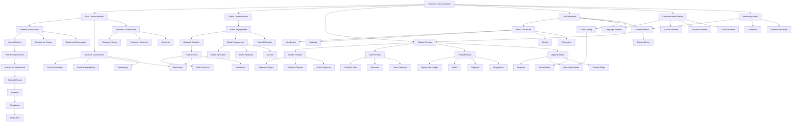

```mermaid
flowchart TD
    SciComm[Scientific Communication] --> PeerComm[Peer Communication]
    SciComm --> PublicComm[Public Communication]
    SciComm --> Formats[Communication Formats]
    PeerComm --> Publications[Scientific Publications]
    Publications --> Journals[Journal Articles]
    Publications --> Conference[Conference Papers]
    Publications --> Books[Books and Monographs]
    Journals --> PeerReview[Peer Review Process]
    PeerReview --> Submission[Manuscript Submission]
    Submission --> Review[Editorial Review]
    Review --> Revision[Revision]
    Revision --> Acceptance[Acceptance]
    Acceptance --> Publication[Publication]
    PeerComm --> Conferences[Scientific Conferences]
    Conferences --> Presentations[Oral Presentations]
    Conferences --> Posters[Poster Presentations]
    Conferences --> Workshops[Workshops]
    Conferences --> Networking[Networking]
    PeerComm --> Collaboration[Scientific Collaboration]
    Collaboration --> Teams[Research Teams]
    Collaboration --> Networks[Research Networks]
    Collaboration --> Consortia[Consortia]
    PublicComm --> PublicEngagement[Public Engagement]
    PublicEngagement --> Outreach[Outreach Activities]
    PublicEngagement --> Media[Media Engagement]
    PublicEngagement --> Education[Public Education]
    Outreach --> Events[Public Events]
    Events --> Lectures[Public Lectures]
    Events --> Workshops[Workshops]
    Events --> Exhibitions[Exhibitions]
    Media --> Interviews[Media Interviews]
    Media --> PressReleases[Press Releases]
    Media --> OpEds[Op-Eds]
    Formats --> Written[Written Formats]
    Written --> Papers[Research Papers]
    Written --> Reports[Technical Reports]
    Written --> Proposals[Grant Proposals]
    Formats --> Oral[Oral Formats]
    Oral --> Talks[Scientific Talks]
    Oral --> Seminars[Seminars]
    Oral --> Defenses[Thesis Defenses]
    Formats --> Visual[Visual Formats]
    Visual --> Figures[Figures and Graphs]
    Visual --> Tables[Tables]
    Visual --> Diagrams[Diagrams]
    Visual --> Infographics[Infographics]
    Formats --> Digital[Digital Formats]
    Digital --> Preprints[Preprints]
    Digital --> Repositories[Repositories]
    Digital --> SocialMedia[Social Media]
    Digital --> Blogs[Science Blogs]
    SciComm --> Standards[Communication Standards]
    Standards --> IMRAD[IMRAD Structure]
    IMRAD --> Introduction[Introduction]
    IMRAD --> Methods[Methods]
    IMRAD --> Results[Results]
    IMRAD --> Discussion[Discussion]
    Standards --> Citations[Citation Standards]
    Citations --> Formats[Citation Formats]
    Citations --> Ethics[Citation Ethics]
    Standards --> DataSharing[Data Sharing]
    DataSharing --> Repositories[Data Repositories]
    DataSharing --> Standards[Data Standards]
    SciComm --> Barriers[Communication Barriers]
    Barriers --> Language[Language Barriers]
    Barriers --> Access[Access Barriers]
    Barriers --> Technical[Technical Barriers]
    Barriers --> Cultural[Cultural Barriers]
    SciComm --> Impact[Measuring Impact]
    Impact --> Citations[Citation Metrics]
    Impact --> Altmetrics[Altmetrics]
    Impact --> Influence[Scientific Influence]
```