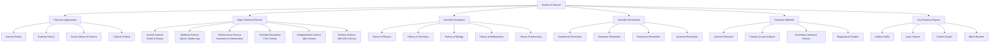

```mermaid
flowchart TD
    HOS[History of Science] --> Approaches[Historical Approaches]
    HOS --> Periods[Major Historical Periods]
    HOS --> Disciplines[Scientific Disciplines]
    HOS --> Revolutions[Scientific Revolutions]
    HOS --> Methods[Research Methods]
    HOS --> KeyFigures[Key Historical Figures]
    Approaches --> Internal[Internal History]
    Approaches --> External[External History]
    Approaches --> Social[Social History of Science]
    Approaches --> Cultural[Cultural Context]
    Periods --> Ancient[Ancient Science<br/>Greek & Roman]
    Periods --> Medieval[Medieval Science<br/>Islamic Golden Age]
    Periods --> Renaissance[Renaissance Science<br/>Humanism & Observation]
    Periods --> ScientificRev[Scientific Revolution<br/>17th Century]
    Periods --> Enlightenment[Enlightenment Science<br/>18th Century]
    Periods --> Modern[Modern Science<br/>19th-20th Century]
    Disciplines --> Physics[History of Physics]
    Disciplines --> Chemistry[History of Chemistry]
    Disciplines --> Biology[History of Biology]
    Disciplines --> Mathematics[History of Mathematics]
    Disciplines --> Astronomy[History of Astronomy]
    Revolutions --> Copernican[Copernican Revolution]
    Revolutions --> Darwinian[Darwinian Revolution]
    Revolutions --> Einsteinian[Einsteinian Revolution]
    Revolutions --> Quantum[Quantum Revolution]
    Methods --> Archival[Archival Research]
    Methods --> PrimarySources[Primary Source Analysis]
    Methods --> SecondarySources[Secondary Literature Review]
    Methods --> Biographical[Biographical Studies]
    KeyFigures --> Galileo[Galileo Galilei]
    KeyFigures --> Newton[Isaac Newton]
    KeyFigures --> Darwin[Charles Darwin]
    KeyFigures --> Einstein[Albert Einstein]
```