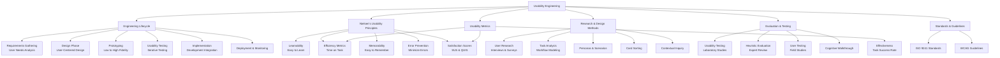

```mermaid
flowchart TD
    UE[Usability Engineering] --> Process[Engineering Lifecycle]
    UE --> Principles[Nielsen's Usability Principles]
    UE --> Methods[Research & Design Methods]
    UE --> Evaluation[Evaluation & Testing]
    UE --> Metrics[Usability Metrics]
    UE --> Standards[Standards & Guidelines]
    Process --> Requirements[Requirements Gathering<br/>User Needs Analysis]
    Process --> Design[Design Phase<br/>User-Centered Design]
    Process --> Prototyping[Prototyping<br/>Low to High Fidelity]
    Process --> Testing[Usability Testing<br/>Iterative Testing]
    Process --> Implementation[Implementation<br/>Development Integration]
    Process --> Deployment[Deployment & Monitoring]
    Principles --> Learnability[Learnability<br/>Easy to Learn]
    Principles --> Efficiency[Efficiency<br/>Fast Task Completion]
    Principles --> Memorability[Memorability<br/>Easy to Remember]
    Principles --> Errors[Error Prevention<br/>Minimize Errors]
    Principles --> Satisfaction[User Satisfaction<br/>Pleasant to Use]
    Methods --> UserResearch[User Research<br/>Interviews & Surveys]
    Methods --> TaskAnalysis[Task Analysis<br/>Workflow Modeling]
    Methods --> Personas[Personas & Scenarios]
    Methods --> CardSorting[Card Sorting]
    Methods --> ContextualInquiry[Contextual Inquiry]
    Evaluation --> UsabilityTesting[Usability Testing<br/>Laboratory Studies]
    Evaluation --> HeuristicEval[Heuristic Evaluation<br/>Expert Review]
    Evaluation --> UserTesting[User Testing<br/>Field Studies]
    Evaluation --> CognitiveWalkthrough[Cognitive Walkthrough]
    Metrics --> Effectiveness[Effectiveness<br/>Task Success Rate]
    Metrics --> Efficiency[Efficiency Metrics<br/>Time on Task]
    Metrics --> Satisfaction[Satisfaction Scores<br/>SUS & QUIS]
    Standards --> ISO[ISO 9241 Standards]
    Standards --> WCAG[WCAG Guidelines]
```