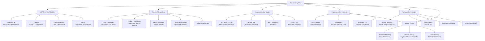

```mermaid
flowchart TD
    A11y[Accessibility A11y] --> Principles[WCAG POUR Principles]
    A11y --> Disabilities[Types of Disabilities]
    A11y --> Standards[Accessibility Standards]
    A11y --> Implementation[Implementation Process]
    A11y --> Technologies[Assistive Technologies]
    A11y --> Testing[Testing & Evaluation]
    Principles --> Perceivable[Perceivable<br/>Information Presentation]
    Principles --> Operable[Operable<br/>Interface Components]
    Principles --> Understandable[Understandable<br/>Clear & Predictable]
    Principles --> Robust[Robust<br/>Compatible Technologies]
    Disabilities --> Visual[Visual Disabilities<br/>Blindness & Low Vision]
    Disabilities --> Auditory[Auditory Disabilities<br/>Deafness & Hard of Hearing]
    Disabilities --> Motor[Motor Disabilities<br/>Limited Mobility]
    Disabilities --> Cognitive[Cognitive Disabilities<br/>Learning & Memory]
    Disabilities --> Speech[Speech Disabilities]
    Standards --> WCAG[WCAG 2.1 & 2.2<br/>Web Content Guidelines]
    Standards --> Section508[Section 508<br/>US Federal Standards]
    Standards --> ARIA[ARIA Standards<br/>WAI-ARIA]
    Standards --> EN301549[EN 301 549<br/>European Standard]
    Implementation --> Design[Design Phase<br/>Inclusive Design]
    Implementation --> Development[Development<br/>Semantic HTML & ARIA]
    Implementation --> Testing[Testing Phase]
    Implementation --> Maintenance[Maintenance<br/>Ongoing Compliance]
    Technologies --> ScreenReaders[Screen Readers<br/>NVDA, JAWS, VoiceOver]
    Technologies --> VoiceControl[Voice Control<br/>Dragon, Siri]
    Technologies --> Keyboard[Keyboard Navigation]
    Technologies --> Magnifiers[Screen Magnifiers]
    Testing --> Automated[Automated Testing<br/>Tools & Scanners]
    Testing --> Manual[Manual Testing<br/>Keyboard & Screen Reader]
    Testing --> UserTesting[User Testing<br/>Disability Community]
```