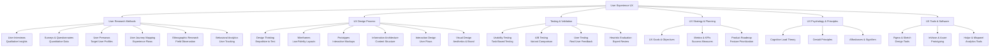

```mermaid
flowchart TD
    UX[User Experience UX] --> Research[User Research Methods]
    UX --> Design[UX Design Process]
    UX --> Testing[Testing & Validation]
    UX --> Strategy[UX Strategy & Planning]
    UX --> Psychology[UX Psychology & Principles]
    UX --> Tools[UX Tools & Software]
    Research --> UserInterviews[User Interviews<br/>Qualitative Insights]
    Research --> Surveys[Surveys & Questionnaires<br/>Quantitative Data]
    Research --> Personas[User Personas<br/>Target User Profiles]
    Research --> UserJourneys[User Journey Mapping<br/>Experience Flows]
    Research --> Ethnography[Ethnographic Research<br/>Field Observation]
    Research --> Analytics[Behavioral Analytics<br/>User Tracking]
    Design --> DesignThinking[Design Thinking<br/>Empathize to Test]
    Design --> Wireframes[Wireframes<br/>Low-Fidelity Layouts]
    Design --> Prototypes[Prototypes<br/>Interactive Mockups]
    Design --> InformationArch[Information Architecture<br/>Content Structure]
    Design --> InteractionDesign[Interaction Design<br/>User Flows]
    Design --> VisualDesign[Visual Design<br/>Aesthetics & Brand]
    Testing --> UsabilityTesting[Usability Testing<br/>Task-Based Testing]
    Testing --> ABTesting[A/B Testing<br/>Variant Comparison]
    Testing --> UserTesting[User Testing<br/>Real User Feedback]
    Testing --> HeuristicEval[Heuristic Evaluation<br/>Expert Review]
    Strategy --> UXGoals[UX Goals & Objectives]
    Strategy --> Metrics[Metrics & KPIs<br/>Success Measures]
    Strategy --> Roadmap[Product Roadmap<br/>Feature Prioritization]
    Psychology --> CognitiveLoad[Cognitive Load Theory]
    Psychology --> Gestalt[Gestalt Principles]
    Psychology --> Affordances[Affordances & Signifiers]
    Tools --> Figma[Figma & Sketch<br/>Design Tools]
    Tools --> InVision[InVision & Axure<br/>Prototyping]
    Tools --> Hotjar[Hotjar & Mixpanel<br/>Analytics Tools]
```