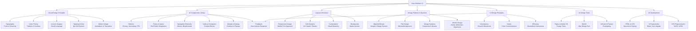

```mermaid
flowchart TD
    UI[User Interface UI] --> VisualDesign[Visual Design Principles]
    UI --> Components[UI Components Library]
    UI --> Layout[Layout & Structure]
    UI --> Patterns[Design Patterns & Systems]
    UI --> Principles[UI Design Principles]
    UI --> Tools[UI Design Tools]
    UI --> Development[UI Development]
    VisualDesign --> Typography[Typography<br/>Fonts & Hierarchy]
    VisualDesign --> Color[Color Theory<br/>Palettes & Contrast]
    VisualDesign --> Icons[Icons & Imagery<br/>Visual Language]
    VisualDesign --> Spacing[Spacing & Grid<br/>8pt Grid System]
    VisualDesign --> Motion[Motion Design<br/>Animations & Transitions]
    Components --> Buttons[Buttons<br/>Primary, Secondary, CTA]
    Components --> Forms[Forms & Inputs<br/>Text Fields, Dropdowns]
    Components --> Navigation[Navigation Elements<br/>Menus, Breadcrumbs]
    Components --> Cards[Cards & Containers<br/>Content Blocks]
    Components --> Modals[Modals & Dialogs<br/>Overlays & Popups]
    Components --> Feedback[Feedback Components<br/>Alerts, Toasts, Progress]
    Layout --> Responsive[Responsive Design<br/>Mobile-First Approach]
    Layout --> Grid[Grid Systems<br/>12-Column, Flexbox]
    Layout --> Composition[Composition<br/>Visual Hierarchy]
    Layout --> Breakpoints[Breakpoints<br/>Media Queries]
    Patterns --> Material[Material Design<br/>Google's Design System]
    Patterns --> Flat[Flat Design<br/>Minimalist Approach]
    Patterns --> DesignSystems[Design Systems<br/>Component Libraries]
    Patterns --> Atomic[Atomic Design<br/>Atoms, Molecules, Organisms]
    Principles --> Consistency[Consistency<br/>Visual & Behavioral]
    Principles --> Clarity[Clarity<br/>Clear Communication]
    Principles --> Feedback[Feedback<br/>User Actions Response]
    Principles --> Efficiency[Efficiency<br/>Streamlined Interactions]
    Tools --> Figma[Figma & Adobe XD<br/>Design Tools]
    Tools --> Sketch[Sketch<br/>Mac Design Tool]
    Tools --> InVision[InVision & Framer<br/>Prototyping]
    Development --> HTML[HTML & CSS<br/>Structure & Styling]
    Development --> Frameworks[UI Frameworks<br/>React, Vue, Angular]
    Development --> CSS[CSS Preprocessors<br/>SASS, LESS]
```