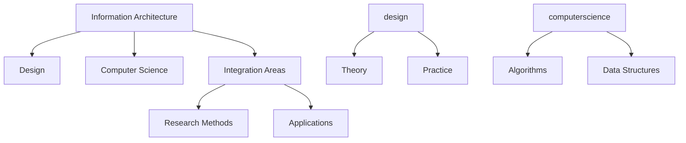

```mermaid
flowchart TD
    InformationArchitecture[Information Architecture] --> Field1[Design]
    InformationArchitecture --> Field2[Computer Science]
    InformationArchitecture --> Integration[Integration Areas]
    design --> designSub1[Theory]
    design --> designSub2[Practice]
    computerscience --> computerscienceSub1[Algorithms]
    computerscience --> computerscienceSub2[Data Structures]
    Integration --> Methods[Research Methods]
    Integration --> Applications[Applications]
```