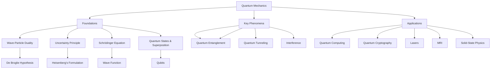

```mermaid
flowchart TD
    QM[Quantum Mechanics] --> F[Foundations]
    QM --> PH[Key Phenomena]
    QM --> APP[Applications]

    F --> WP[Wave-Particle Duality]
    F --> UP[Uncertainty Principle]
    F --> SE[Schrödinger Equation]
    F --> QS[Quantum States & Superposition]

    WP --> DE[De Broglie Hypothesis]
    UP --> HI[Heisenberg's Formulation]
    SE --> WF[Wave Function]
    QS --> Q[Qubits]

    PH --> QE[Quantization of Energy]
    PH --> QT[Quantum Tunneling]
    PH --> QE[Quantum Entanglement]
    PH --> INT[Interference]

    APP --> QCOMP[Quantum Computing]
    APP --> QCRY[Quantum Cryptography]
    APP --> LASER[Lasers]
    APP --> MRI[MRI]
    APP --> SS[Solid-State Physics]
```
