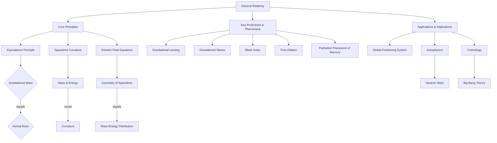

```mermaid
flowchart TD
    GR[General Relativity] --> Cores[Core Principles]
    GR --> Pred[Key Predictions & Phenomena]
    GR --> App[Applications & Implications]

    Cores --> EP[Equivalence Principle]
    Cores --> STC[Spacetime Curvature]
    Cores --> FE[Einstein Field Equations]

    EP --> GravMass{Gravitational Mass} -- equals --> InertMass{Inertial Mass}
    STC --> M[Mass & Energy] -- cause --> Curvature
    FE --> G[Geometry of Spacetime] -- equals --> ME[Mass-Energy Distribution]

    Pred --> GL[Gravitational Lensing]
    Pred --> GW[Gravitational Waves]
    Pred --> BH[Black Holes]
    Pred --> TD[Time Dilation]
    Pred --> PS[Perihelion Precession of Mercury]

    App --> GPS[Global Positioning System]
    App --> Astro[Astrophysics]
    App --> Cosmo[Cosmology]

    Astro --> NS[Neutron Stars]
    Cosmo --> BB[Big Bang Theory]
```
