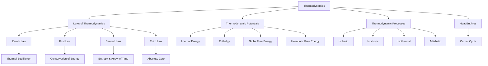

```mermaid
flowchart TD
    Thermo[Thermodynamics] --> Laws[Laws of Thermodynamics]
    Thermo --> Potentials[Thermodynamic Potentials]
    Thermo --> Processes[Thermodynamic Processes]

    Laws --> Zero[Zeroth Law]
    Laws --> First[First Law]
    Laws --> Second[Second Law]
    Laws --> Third[Third Law]

    Zero --> TE[Thermal Equilibrium]
    First --> CoE[Conservation of Energy]
    Second --> E[Entropy & Arrow of Time]
    Third --> AZ[Absolute Zero]

    Potentials --> IE[Internal Energy]
    Potentials --> H[Enthalpy]
    Potentials --> G[Gibbs Free Energy]
    Potentials --> F[Helmholtz Free Energy]

    Processes --> Isobaric[Isobaric]
    Processes --> Isochoric[Isochoric]
    Processes --> Isothermal[Isothermal]
    Processes --> Adiabatic[Adiabatic]

    Thermo --> HE[Heat Engines]
    HE --> CS[Carnot Cycle]
```
