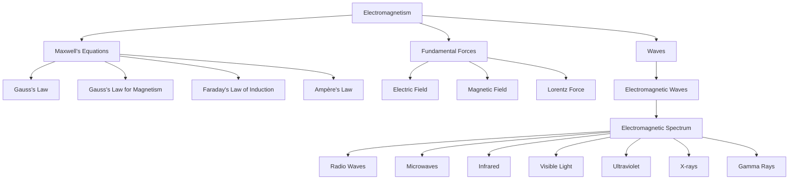

```mermaid
flowchart TD
    EM[Electromagnetism] --> ME[Maxwell's Equations]
    EM --> F[Fundamental Forces]
    EM --> W[Waves]

    ME --> GL[Gauss's Law]
    ME --> GLM[Gauss's Law for Magnetism]
    ME --> FL[Faraday's Law of Induction]
    ME --> AL[Ampère's Law]

    F --> EF[Electric Field]
    F --> MF[Magnetic Field]
    F --> LF[Lorentz Force]

    W --> EMW[Electromagnetic Waves]
    EMW --> Spectrum[Electromagnetic Spectrum]

    Spectrum --> Radio[Radio Waves]
    Spectrum --> Micro[Microwaves]
    Spectrum --> IR[Infrared]
    Spectrum --> VL[Visible Light]
    Spectrum --> UV[Ultraviolet]
    Spectrum --> XRay[X-rays]
    Spectrum --> Gamma[Gamma Rays]
```
