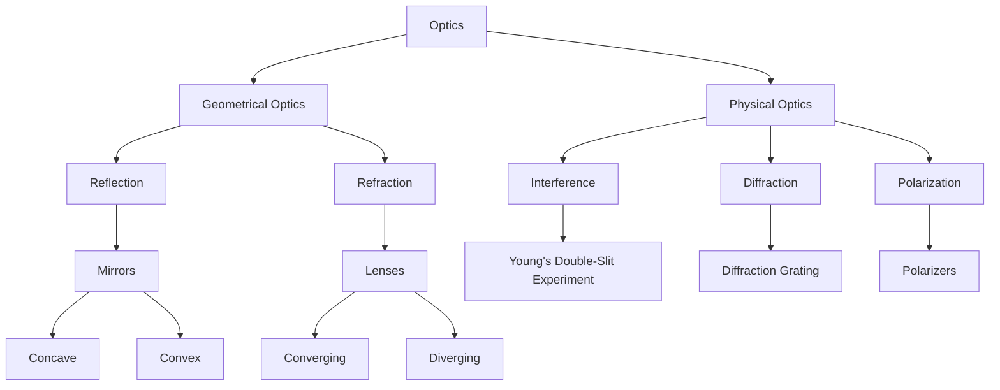

```mermaid
flowchart TD
    Optics[Optics] --> GO[Geometrical Optics]
    Optics --> PO[Physical Optics]

    GO --> Reflection[Reflection]
    GO --> Refraction[Refraction]

    Reflection --> Mirrors[Mirrors]
    Mirrors --> Concave[Concave]
    Mirrors --> Convex[Convex]

    Refraction --> Lenses[Lenses]
    Lenses --> Converging[Converging]
    Lenses --> Diverging[Diverging]

    PO --> Interference[Interference]
    PO --> Diffraction[Diffraction]
    PO --> Polarization[Polarization]

    Interference --> YDE[Young's Double-Slit Experiment]
    Diffraction --> DG[Diffraction Grating]
    Polarization --> Polarizers[Polarizers]
```
