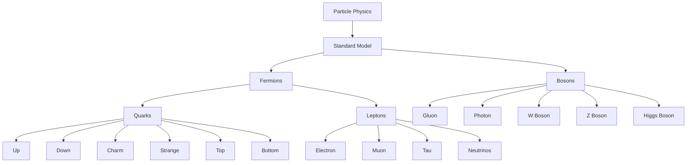

```mermaid
flowchart TD
    PP[Particle Physics] --> SM[Standard Model]

    SM --> Fermions[Fermions]
    SM --> Bosons[Bosons]

    Fermions --> Quarks[Quarks]
    Fermions --> Leptons[Leptons]

    Quarks --> Up[Up]
    Quarks --> Down[Down]
    Quarks --> Charm[Charm]
    Quarks --> Strange[Strange]
    Quarks --> Top[Top]
    Quarks --> Bottom[Bottom]

    Leptons --> Electron[Electron]
    Leptons --> Muon[Muon]
    Leptons --> Tau[Tau]
    Leptons --> Neutrinos[Neutrinos]

    Bosons --> Gluon[Gluon]
    Bosons --> Photon[Photon]
    Bosons --> WB[W Boson]
    Bosons --> ZB[Z Boson]
    Bosons --> Higgs[Higgs Boson]
```
