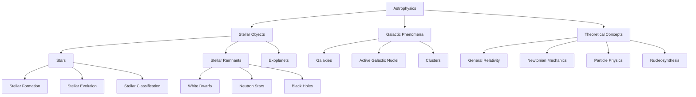

```mermaid
flowchart TD
    Astrophysics[Astrophysics] --> SO[Stellar Objects]
    Astrophysics --> GP[Galactic Phenomena]
    Astrophysics --> T[Theoretical Concepts]

    SO --> Stars[Stars]
    SO --> Remnants[Stellar Remnants]
    SO --> Exoplanets[Exoplanets]

    Stars --> Formation[Stellar Formation]
    Stars --> Evolution[Stellar Evolution]
    Stars --> Classification[Stellar Classification]

    Remnants --> WD[White Dwarfs]
    Remnants --> NS[Neutron Stars]
    Remnants --> BH[Black Holes]

    GP --> Galaxies[Galaxies]
    GP --> AGN[Active Galactic Nuclei]
    GP --> C[Clusters]

    T --> GR[General Relativity]
    T --> NM[Newtonian Mechanics]
    T --> PP[Particle Physics]
    T --> NU[Nucleosynthesis]
```
