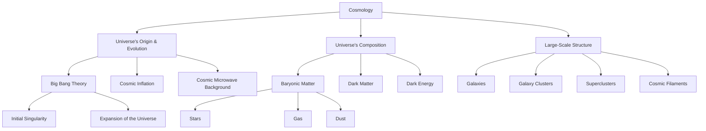

```mermaid
flowchart TD
    Cosmology[Cosmology] --> UO[Universe's Origin & Evolution]
    Cosmology --> UC[Universe's Composition]
    Cosmology --> LS[Large-Scale Structure]

    UO --> BB[Big Bang Theory]
    UO --> Inflation[Cosmic Inflation]
    UO --> CMB[Cosmic Microwave Background]

    BB --> Singularity[Initial Singularity]
    BB --> Expansion[Expansion of the Universe]

    UC --> BM[Baryonic Matter]
    UC --> DM[Dark Matter]
    UC --> DE[Dark Energy]

    BM --> Stars[Stars]
    BM --> Gas[Gas]
    BM --> Dust[Dust]

    LS --> Galaxies[Galaxies]
    LS --> Clusters[Galaxy Clusters]
    LS --> Superclusters[Superclusters]
    LS --> Filaments[Cosmic Filaments]
```
