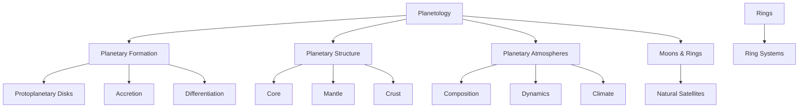

```mermaid
flowchart TD
    Planetology[Planetology] --> Formation[Planetary Formation]
    Planetology --> Structure[Planetary Structure]
    Planetology --> Atmospheres[Planetary Atmospheres]
    Planetology --> Moons[Moons & Rings]

    Formation --> PPD[Protoplanetary Disks]
    Formation --> Accretion[Accretion]
    Formation --> Differentiation[Differentiation]

    Structure --> Core[Core]
    Structure --> Mantle[Mantle]
    Structure --> Crust[Crust]

    Atmospheres --> Composition[Composition]
    Atmospheres --> Dynamics[Dynamics]
    Atmospheres --> Climate[Climate]

    Moons --> Natural[Natural Satellites]
    Rings --> System[Ring Systems]
```
