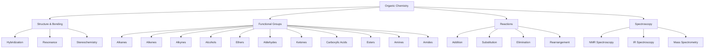

```mermaid
flowchart TD
    OC[Organic Chemistry] --> SF[Structure & Bonding]
    OC --> FG[Functional Groups]
    OC --> RX[Reactions]
    OC --> S[Spectroscopy]

    SF --> H[Hybridization]
    SF --> R[Resonance]
    SF --> SC[Stereochemistry]

    FG --> Alkanes[Alkanes]
    FG --> Alkenes[Alkenes]
    FG --> Alkynes[Alkynes]
    FG --> Alcohols[Alcohols]
    FG --> Ethers[Ethers]
    FG --> Aldehydes[Aldehydes]
    FG --> Ketones[Ketones]
    FG --> CA[Carboxylic Acids]
    FG --> Esters[Esters]
    FG --> Amines[Amines]
    FG --> Amides[Amides]

    RX --> Add[Addition]
    RX --> Sub[Substitution]
    RX --> Elim[Elimination]
    RX --> RA[Rearrangement]

    S --> NMR[NMR Spectroscopy]
    S --> IR[IR Spectroscopy]
    S --> MS[Mass Spectrometry]
```
