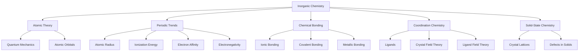

```mermaid
flowchart TD
    IC[Inorganic Chemistry] --> AT[Atomic Theory]
    IC --> PT[Periodic Trends]
    IC --> CB[Chemical Bonding]
    IC --> CC[Coordination Chemistry]
    IC --> SS[Solid-State Chemistry]

    AT --> QM[Quantum Mechanics]
    AT --> AO[Atomic Orbitals]

    PT --> AR[Atomic Radius]
    PT --> IE[Ionization Energy]
    PT --> EA[Electron Affinity]
    PT --> EN[Electronegativity]

    CB --> Ionic[Ionic Bonding]
    CB --> Covalent[Covalent Bonding]
    CB --> Metallic[Metallic Bonding]

    CC --> Ligands[Ligands]
    CC --> CFT[Crystal Field Theory]
    CC --> LFT[Ligand Field Theory]

    SS --> CL[Crystal Lattices]
    SS --> Defects[Defects in Solids]
```
