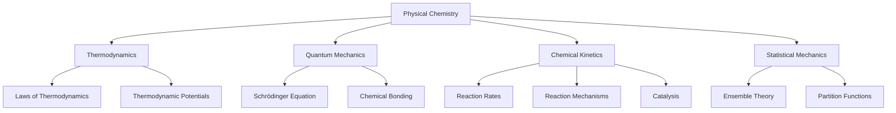

```mermaid
flowchart TD
    PC[Physical Chemistry] --> Thermo[Thermodynamics]
    PC --> QM[Quantum Mechanics]
    PC --> Kinetics[Chemical Kinetics]
    PC --> SM[Statistical Mechanics]

    Thermo --> Laws[Laws of Thermodynamics]
    Thermo --> Potentials[Thermodynamic Potentials]

    QM --> SE[Schrödinger Equation]
    QM --> Bonding[Chemical Bonding]

    Kinetics --> RR[Reaction Rates]
    Kinetics --> RM[Reaction Mechanisms]
    Kinetics --> Catalysis[Catalysis]

    SM --> EF[Ensemble Theory]
    SM --> PF[Partition Functions]
```
