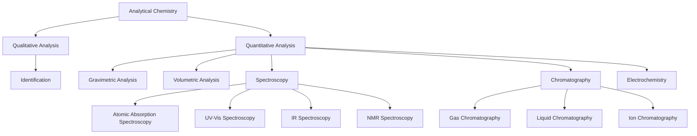

```mermaid
flowchart TD
    AC[Analytical Chemistry] --> QA[Qualitative Analysis]
    AC --> QNA[Quantitative Analysis]

    QA --> Id[Identification]

    QNA --> Grav[Gravimetric Analysis]
    QNA --> Vol[Volumetric Analysis]
    QNA --> Spec[Spectroscopy]
    QNA --> Chrom[Chromatography]
    QNA --> Elec[Electrochemistry]

    Spec --> AAS[Atomic Absorption Spectroscopy]
    Spec --> UVVis[UV-Vis Spectroscopy]
    Spec --> IR[IR Spectroscopy]
    Spec --> NMR[NMR Spectroscopy]

    Chrom --> GC[Gas Chromatography]
    Chrom --> LC[Liquid Chromatography]
    Chrom --> IC[Ion Chromatography]
```
