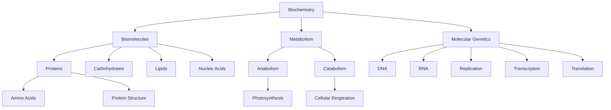

```mermaid
flowchart TD
    Biochem[Biochemistry] --> Biomolecules[Biomolecules]
    Biochem --> Metabolism[Metabolism]
    Biochem --> Genetics[Molecular Genetics]

    Biomolecules --> Proteins[Proteins]
    Biomolecules --> Carbs[Carbohydrates]
    Biomolecules --> Lipids[Lipids]
    Biomolecules --> NucleicAcids[Nucleic Acids]

    Proteins --> AminoAcids[Amino Acids]
    Proteins --> Structure[Protein Structure]

    Metabolism --> Anabolism[Anabolism]
    Metabolism --> Catabolism[Catabolism]

    Anabolism --> Photosynthesis[Photosynthesis]
    Catabolism --> CellularRespiration[Cellular Respiration]

    Genetics --> DNA[DNA]
    Genetics --> RNA[RNA]
    Genetics --> Replication[Replication]
    Genetics --> Transcription[Transcription]
    Genetics --> Translation[Translation]
```
