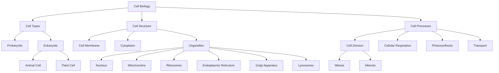

```mermaid
flowchart TD
    CB[Cell Biology] --> CT[Cell Types]
    CB --> CS[Cell Structure]
    CB --> CP[Cell Processes]

    CT --> Prokaryotic[Prokaryotic]
    CT --> Eukaryotic[Eukaryotic]

    Eukaryotic --> Animal[Animal Cell]
    Eukaryotic --> Plant[Plant Cell]

    CS --> Membrane[Cell Membrane]
    CS --> Cytoplasm[Cytoplasm]
    CS --> Organelles[Organelles]

    Organelles --> Nucleus[Nucleus]
    Organelles --> Mitochondria[Mitochondria]
    Organelles --> Ribosomes[Ribosomes]
    Organelles --> ER[Endoplasmic Reticulum]
    Organelles --> Golgi[Golgi Apparatus]
    Organelles --> Lysosomes[Lysosomes]

    CP --> CD[Cell Division]
    CP --> CR[Cellular Respiration]
    CP --> PS[Photosynthesis]
    CP --> TS[Transport]

    CD --> Mitosis[Mitosis]
    CD --> Meiosis[Meiosis]
```
