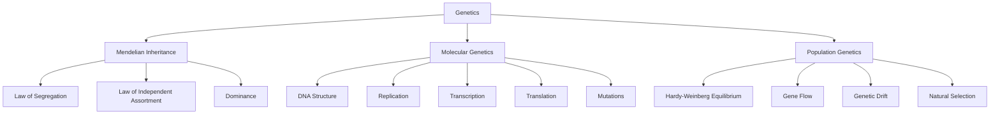

```mermaid
flowchart TD
    Genetics --> MI[Mendelian Inheritance]
    Genetics --> MG[Molecular Genetics]
    Genetics --> PG[Population Genetics]

    MI --> LoS[Law of Segregation]
    MI --> LoIA[Law of Independent Assortment]
    MI --> Dom[Dominance]

    MG --> DNA[DNA Structure]
    MG --> Rep[Replication]
    MG --> Transc[Transcription]
    MG --> Transl[Translation]
    MG --> Mut[Mutations]

    PG --> HW[Hardy-Weinberg Equilibrium]
    PG --> GF[Gene Flow]
    PG --> GD[Genetic Drift]
    PG --> NS[Natural Selection]
```
