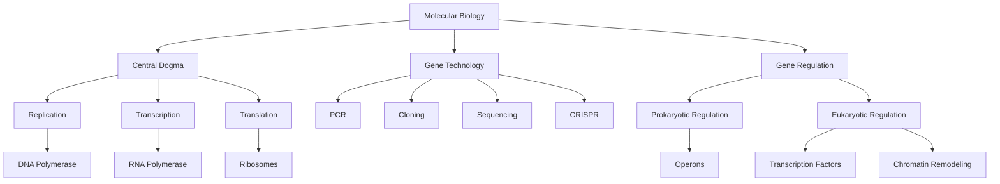

```mermaid
flowchart TD
    MB[Molecular Biology] --> CD[Central Dogma]
    MB --> GT[Gene Technology]
    MB --> GR[Gene Regulation]

    CD --> Rep[Replication]
    CD --> Transc[Transcription]
    CD --> Transl[Translation]

    Rep --> DNA_Polymerase[DNA Polymerase]
    Transc --> RNA_Polymerase[RNA Polymerase]
    Transl --> Ribosomes[Ribosomes]

    GT --> PCR[PCR]
    GT --> Cloning[Cloning]
    GT --> Sequencing[Sequencing]
    GT --> CRISPR[CRISPR]

    GR --> Prokaryotic[Prokaryotic Regulation]
    GR --> Eukaryotic[Eukaryotic Regulation]

    Prokaryotic --> Operons[Operons]
    Eukaryotic --> TFs[Transcription Factors]
    Eukaryotic --> Chromatin[Chromatin Remodeling]
```
