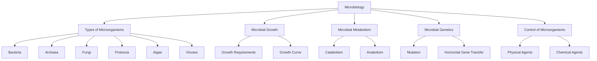

```mermaid
flowchart TD
    Microbiology --> Microorganisms[Types of Microorganisms]
    Microbiology --> Growth[Microbial Growth]
    Microbiology --> Metabolism[Microbial Metabolism]
    Microbiology --> Genetics[Microbial Genetics]
    Microbiology --> Control[Control of Microorganisms]

    Microorganisms --> Bacteria[Bacteria]
    Microorganisms --> Archaea[Archaea]
    Microorganisms --> Fungi[Fungi]
    Microorganisms --> Protozoa[Protozoa]
    Microorganisms --> Algae[Algae]
    Microorganisms --> Viruses[Viruses]

    Growth --> Requirements[Growth Requirements]
    Growth --> Curve[Growth Curve]

    Metabolism --> Catabolism[Catabolism]
    Metabolism --> Anabolism[Anabolism]

    Genetics --> Mutation[Mutation]
    Genetics --> HGT[Horizontal Gene Transfer]

    Control --> Physical[Physical Agents]
    Control --> Chemical[Chemical Agents]
```
