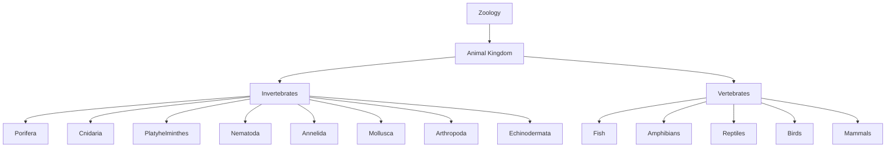

```mermaid
flowchart TD
    Zoology --> Kingdom[Animal Kingdom]

    Kingdom --> Invertebrates[Invertebrates]
    Kingdom --> Vertebrates[Vertebrates]

    Invertebrates --> Porifera[Porifera]
    Invertebrates --> Cnidaria[Cnidaria]
    Invertebrates --> Platyhelminthes[Platyhelminthes]
    Invertebrates --> Nematoda[Nematoda]
    Invertebrates --> Annelida[Annelida]
    Invertebrates --> Mollusca[Mollusca]
    Invertebrates --> Arthropoda[Arthropoda]
    Invertebrates --> Echinodermata[Echinodermata]

    Vertebrates --> Fish[Fish]
    Vertebrates --> Amphibians[Amphibians]
    Vertebrates --> Reptiles[Reptiles]
    Vertebrates --> Birds[Birds]
    Vertebrates --> Mammals[Mammals]
```
