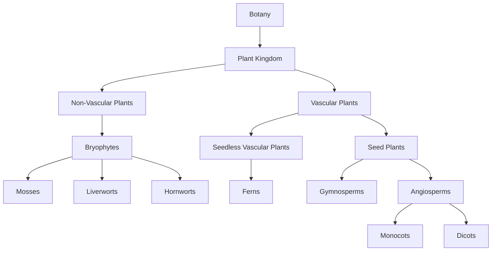

```mermaid
flowchart TD
    Botany --> Kingdom[Plant Kingdom]

    Kingdom --> NonVascular[Non-Vascular Plants]
    Kingdom --> Vascular[Vascular Plants]

    NonVascular --> Bryophytes[Bryophytes]
    Bryophytes --> Mosses[Mosses]
    Bryophytes --> Liverworts[Liverworts]
    Bryophytes --> Hornworts[Hornworts]

    Vascular --> Seedless[Seedless Vascular Plants]
    Vascular --> Seed[Seed Plants]

    Seedless --> Ferns[Ferns]

    Seed --> Gymnosperms[Gymnosperms]
    Seed --> Angiosperms[Angiosperms]

    Angiosperms --> Monocots[Monocots]
    Angiosperms --> Dicots[Dicots]
```
