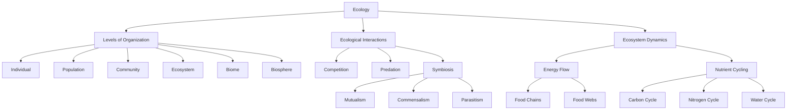

```mermaid
flowchart TD
    Ecology --> Levels[Levels of Organization]
    Ecology --> Interactions[Ecological Interactions]
    Ecology --> Ecosystems[Ecosystem Dynamics]

    Levels --> Individual[Individual]
    Levels --> Population[Population]
    Levels --> Community[Community]
    Levels --> Ecosystem[Ecosystem]
    Levels --> Biome[Biome]
    Levels --> Biosphere[Biosphere]

    Interactions --> Competition[Competition]
    Interactions --> Predation[Predation]
    Interactions --> Symbiosis[Symbiosis]

    Symbiosis --> Mutualism[Mutualism]
    Symbiosis --> Commensalism[Commensalism]
    Symbiosis --> Parasitism[Parasitism]

    Ecosystems --> EnergyFlow[Energy Flow]
    Ecosystems --> NutrientCycling[Nutrient Cycling]

    EnergyFlow --> FoodChains[Food Chains]
    EnergyFlow --> FoodWebs[Food Webs]

    NutrientCycling --> CarbonCycle[Carbon Cycle]
    NutrientCycling --> NitrogenCycle[Nitrogen Cycle]
    NutrientCycling --> WaterCycle[Water Cycle]
```
