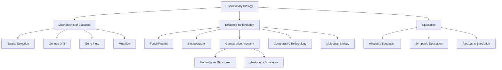

```mermaid
flowchart TD
    EB[Evolutionary Biology] --> Mechanisms[Mechanisms of Evolution]
    EB --> Evidence[Evidence for Evolution]
    EB --> Speciation[Speciation]

    Mechanisms --> NS[Natural Selection]
    Mechanisms --> GD[Genetic Drift]
    Mechanisms --> GF[Gene Flow]
    Mechanisms --> Mutation[Mutation]

    Evidence --> Fossils[Fossil Record]
    Evidence --> Biogeography[Biogeography]
    Evidence --> Anatomy[Comparative Anatomy]
    Evidence --> Embryology[Comparative Embryology]
    Evidence --> Molecular[Molecular Biology]

    Anatomy --> Homologous[Homologous Structures]
    Anatomy --> Analogous[Analogous Structures]

    Speciation --> Allopatric[Allopatric Speciation]
    Speciation --> Sympatric[Sympatric Speciation]
    Speciation --> Parapatric[Parapatric Speciation]
```
