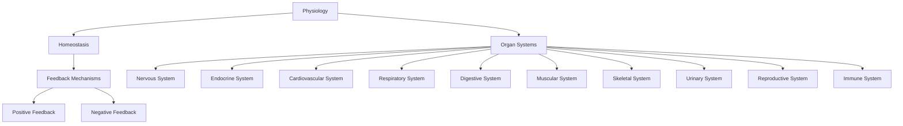

```mermaid
flowchart TD
    Physiology --> Homeostasis[Homeostasis]
    Physiology --> Systems[Organ Systems]

    Homeostasis --> Feedback[Feedback Mechanisms]
    Feedback --> Positive[Positive Feedback]
    Feedback --> Negative[Negative Feedback]

    Systems --> Nervous[Nervous System]
    Systems --> Endocrine[Endocrine System]
    Systems --> Cardiovascular[Cardiovascular System]
    Systems --> Respiratory[Respiratory System]
    Systems --> Digestive[Digestive System]
    Systems --> Muscular[Muscular System]
    Systems --> Skeletal[Skeletal System]
    Systems --> Urinary[Urinary System]
    Systems --> Reproductive[Reproductive System]
    Systems --> Immune[Immune System]
```
