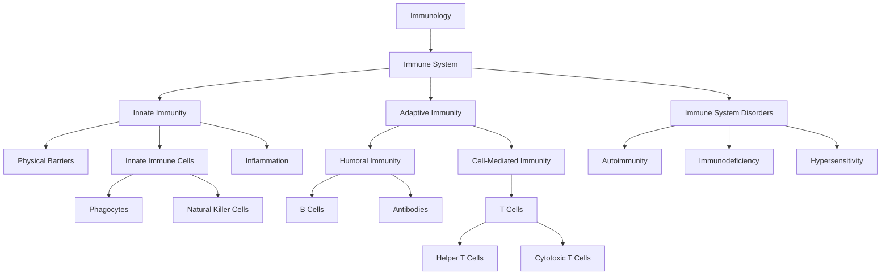

```mermaid
flowchart TD
    Immunology --> IS[Immune System]

    IS --> Innate[Innate Immunity]
    IS --> Adaptive[Adaptive Immunity]

    Innate --> Barriers[Physical Barriers]
    Innate --> Cells[Innate Immune Cells]
    Innate --> Inflammation[Inflammation]

    Cells --> Phagocytes[Phagocytes]
    Cells --> NKC[Natural Killer Cells]

    Adaptive --> Humoral[Humoral Immunity]
    Adaptive --> CellMediated[Cell-Mediated Immunity]

    Humoral --> BCells[B Cells]
    Humoral --> Antibodies[Antibodies]

    CellMediated --> TCells[T Cells]
    TCells --> Helper[Helper T Cells]
    TCells --> Cytotoxic[Cytotoxic T Cells]

    IS --> Disorders[Immune System Disorders]
    Disorders --> Autoimmunity[Autoimmunity]
    Disorders --> Immunodeficiency[Immunodeficiency]
    Disorders --> Hypersensitivity[Hypersensitivity]
```
